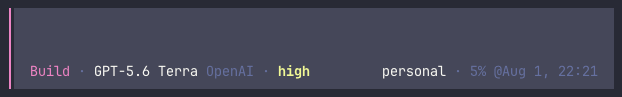
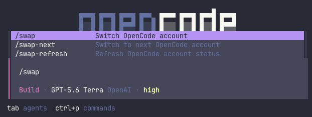

# opencode-swap OpenCode TUI plugin

Optional OpenCode terminal UI integration. `opencode-swap` remains sole owner
of credentials and account-switch transactions.





## Requirements

This plugin's `status --json` parsing is pinned to `schema_version: 2`
(OpenAI's 5h rate-limit window). It rejects responses from an older CLI
outright rather than misreading them — keep the CLI at 0.3.0 or newer.

## Install from npm

Install the Python CLI first, then install TUI package globally:

```bash
uv tool install opencode-swap
opencode plugin @leinardi/opencode-swap --global
```

Restart OpenCode. The plugin invokes `opencode-swap` from `PATH`.

## Install from this checkout

Add this path to global `~/.config/opencode/tui.json`:

```json
{
  "$schema": "https://opencode.ai/tui.json",
  "plugin": [
    "/absolute/path/to/opencode-swap/integrations/opencode-tui-plugin/src/tui.tsx"
  ]
}
```

OpenCode installs `@opencode-ai/plugin` for config-scoped local plugins when
needed. Restart the TUI after editing `tui.json`.

## Build

The npm payload ships `dist/tui.js`, precompiled with OpenTUI's own Solid
transform (`bun run build`). This is not an optimization: OpenCode's runtime
Solid transform deliberately skips anything under `node_modules`, so a
package that exports raw `.tsx` loads through Bun's generic JSX runtime
instead — it renders once with no reactivity wired, silently freezing the
widget while commands keep working. A checkout path is outside
`node_modules`, so "Install from this checkout" above keeps working from
`src/tui.tsx` directly.

## Typecheck

Requires Bun 1.3.14. Root `make verify` installs locked dependencies and runs
typecheck and npm payload check. To run only integration verification, use
`make tui-plugin-typecheck` or `make tui-plugin-package-check`.

Set a non-default CLI path, or disable usage lookups (see "Network access"
below), through a plugin tuple. `command` must point directly to the
`opencode-swap` executable, not the project directory. For a checkout managed
by `uv`, the executable is normally `.venv/bin/opencode-swap`:

```json
{
  "plugin": [
    [
      "/absolute/path/to/opencode-swap/integrations/opencode-tui-plugin/src/tui.tsx",
      {
        "command": "/absolute/path/to/opencode-swap/.venv/bin/opencode-swap",
        "usage": false
      }
    ]
  ]
}
```

## Network access

By default, every 60-second refresh runs `opencode-swap status <provider>
--json --usage` for the session's active provider when it's a managed
account. For a provider with a usage source, that command sends **that
account's own live credential** as a `Bearer` header to the provider's usage
endpoint (see `usage.py`), to fetch the usage percentage and reset time for
every quota window the provider reports, shown next to the account name:

- OpenAI ChatGPT OAuth → the OAuth access token to
  `https://chatgpt.com/backend-api/wham/usage` (currently a 5-hour and a
  7-day window).
- Z.AI `zai-coding-plan` → the account API key to
  `https://api.z.ai/api/monitor/usage/quota/limit` (GLM Coding Plan session
  and weekly windows).

Every other provider makes no usage request.

Set `{ "usage": false }` in the plugin options (see above) to disable this:
the widget then shows only the account name, and the plugin makes no network
calls at all; every other refresh continues to use plain `status --json`,
which is fully local/offline.

## Behavior

- Shows `<account> · 5h <usage>% @<reset> | 7d <usage>% @<reset>` at right
  side of session prompt metadata, one entry per quota window the provider
  reports for the account -- labelled by that window's own duration, so it
  adapts automatically if the provider reports one window, three, or a
  different length. Each window is colored independently. When the provider
  supplies that window's duration and reset time, usage color compares spend against linear
  progress through that exact window: green below 85% of projection, orange
  below 105%, and red at or above 105% (the first 5% of the window always
  stays green). Without complete window data, absolute usage is green below
  50%, yellow from 50%, orange from 70%, and red from 90%.
- Shows nothing until session has sent a request using provider managed by
  `opencode-swap`.
- Uses latest sent user message's `model.providerID`, not internal OpenCode
  model-selection state. A model change appears after its next request.
- Refreshes every 60 seconds, whenever the active provider changes, and on
  `/swap-refresh`. Usage is only requested while latest request used a
  managed provider.
- `/swap` and palette command **Switch OpenCode account** show account picker
  and confirmation dialog. `/swap-next` runs provider-local round-robin for
  latest request's managed provider. `/swap-refresh` refreshes visible status.
- Refuses a switch while current TUI session has non-idle status. It cannot
  observe other OpenCode sessions or processes; confirmation explains residual
  auth-file refresh race.

Plugin invokes `opencode-swap` through argument-array `Bun.spawn`, parses only
`status --json` and, unless disabled, `status --json --usage` (see "Network
access"), and never reads `auth.json`, registry, or secret storage.
